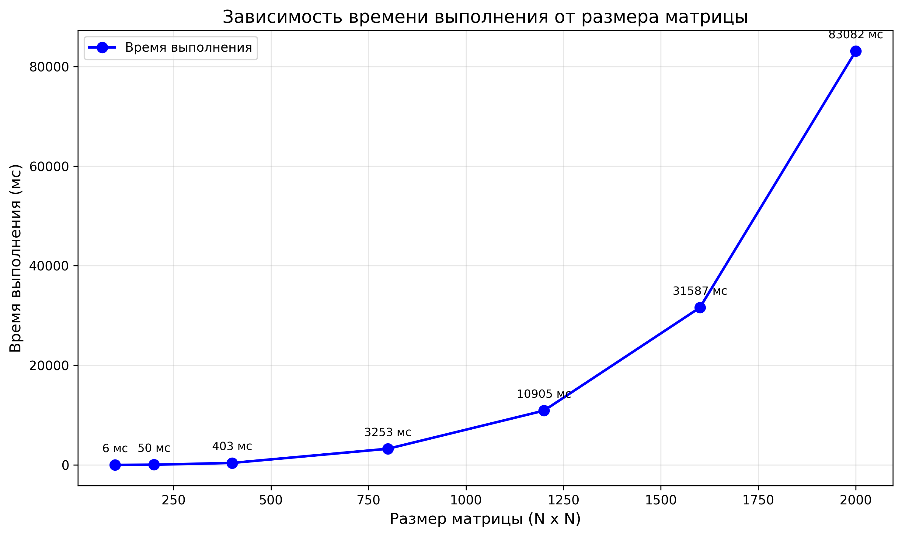

**Лабораторная работа:** №1
**Выполнил:** Катюшин Егор Сергеевич  
**Группа:** 6213-100503D 

## 1. Цель работы
Разработка программы на C++ для перемножения двух квадратных матриц с измерением времени выполнения, подсчётом объёма задачи и верификацией результатов с помощью Python (NumPy).

## 2. Структура проекта
- `matrix.hpp` - Класс Matrix, для работы с матрицей
- `main.cpp` - Основной файл, где производятся необходимые по заданию операции
- `create_matrix.py` - Генерация матриц и сохранение в виде файла
- `verify.py` - Проверка результатов через NumPy
- `CMakeLists.txt` - конфигурация для сборки проекта
- `info.txt` - результаты экспериментов (время и количество операций)
- `time_vs_size.png` - график зависимости времени от размера матрицы

### 3.1. Генерация матриц
Для проведения экспериментов были сгенерированы квадратные матрицы следующих размеров:
- 100x100
- 200x200
- 400x400
- 800x800
- 1200x1200
- 1600x1600
- 2000x2000

Для каждого размера созданы две матрицы со случайными значениями.

### 3.2. Результаты измерений

#### Таблица 1 - Время выполнения и объём вычислений

| Размер матрицы | Количество операций | Время выполнения (мс) |
| 100 x 100      | 2 000 000           | 6                     |
| 200 x 200      | 18 000 000          | 50                    |
| 400 x 400      | 146 000 000         | 403                   |
| 800 x 800      | 1 170 000 000       | 3 253                 |
| 1 200 x 1 200  | 4 626 000 000       | 10 905                |
| 1 600 x 1 600  | 12 818 000 000      | 31 587                |
| 2 000 x 2 000  | 28 818 000 000      | 83 082                |

### 3.3. График зависимости времени от размера матрицы



*Рисунок 1 - Зависимость времени выполнения от размера матрицы*

## 4. Инструкция по запуску

### 4.1. Генерация матриц
```bash
python create_matrix.py
```

### 4.2. Сборка программы (CMake)
```bash
mkdir build
cd build
cmake ..
cmake --build .
```

### 3.3. Запуск программы умножения
```bash
# Windows
./LinkedList.exe

# Linux/macOS
./LinkedList
```

**Что происходит:**
1. Чтение `matrixA{size}x{size}.txt` и `matrixB{size}x{size}.txt`
2. Умножение матриц с подсчётом операций
3. Сохранение результатов:
   - `result{size}x{size}.txt` - результирующая матрица
   - `info.txt` - время и количество операций

## 3.4. Верификация результатов
`python verify.py`

**Что происходит:**
- Чтение `matrixA{size}x{size}.txt` и `matrixB{size}x{size}.txt`
- Вычисление эталонного результата через NumPy (`np.dot`)
- Сравнение результатов с помощью `np.allclose`
- Вывод результата проверки в терминал